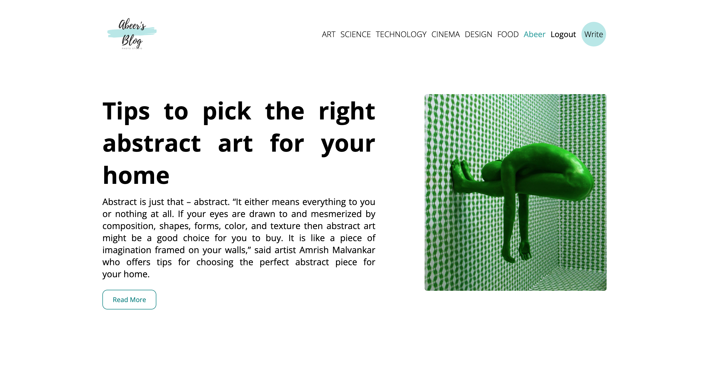
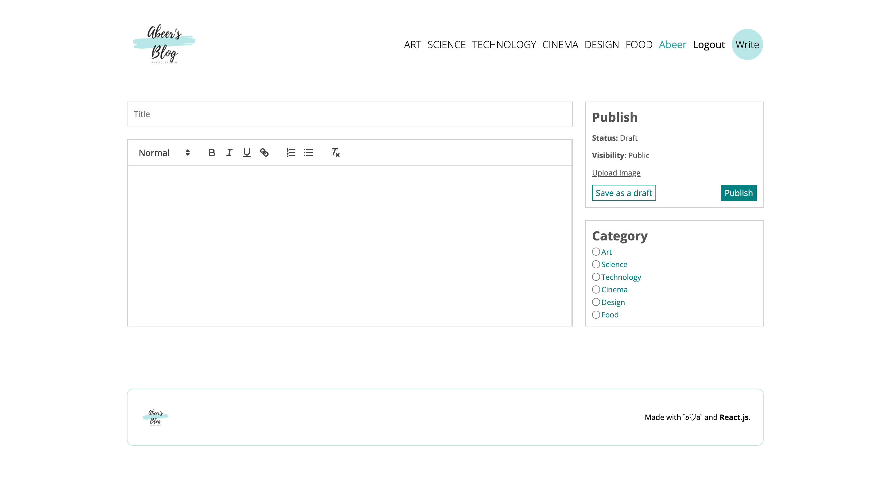
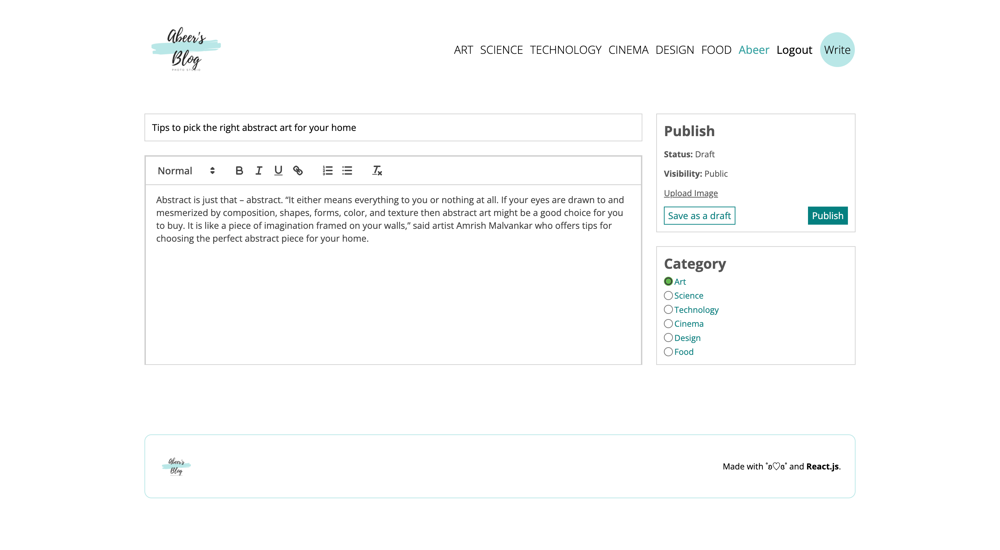
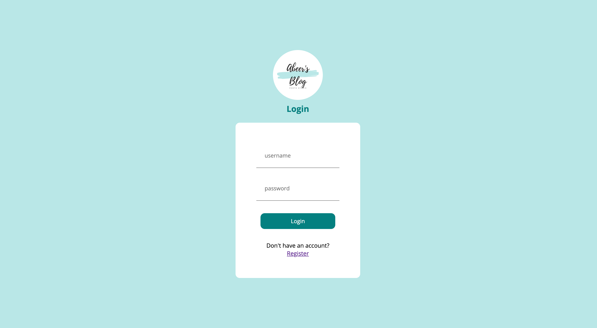
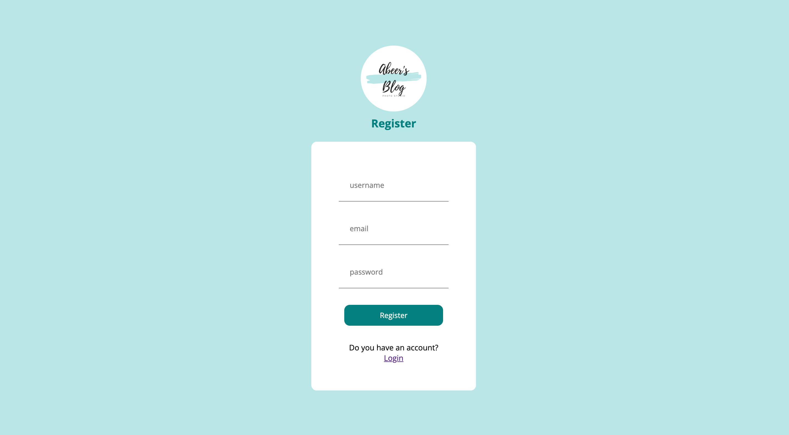

# My-Blog

## Table of Content
* General Information
* Technologies Used
* Features
* Screenshot
* Installation and Setup Instructions
* Usage
* Project Status
* Room for Improvement
* Acknowledgements
* Contact

## General Information
I created this Blog that displays blog posts from different users, filters posts based on their assigned category, allows for user registration and login, and allows the account holder to write, update, and delete their posts. This project uses ReactJS, react-routing, react hooks such as: useState and useNavigation, NodeJS, MySQL, Cors, Nodemon, Express, Postman, bCrypt, ReactQuill, jsonwebtoken, Cookie-parser, Moment, Multer, and SCSS.

### Purpose of this project
To demonstrate full stack abilities.

## Technologies Used
* ReactJS
* React Router
* HTML
* JavaScript
* NodeJS
* MySQL
* Cors
* Nodemon
* Postman
* Express
* bCrypt
* ReactQuill
* jsonwebtoken 
* Cookie-parser
* Moment
* Multer
* SCSS

## Features
* React-routing.
* A Home page.
* A write new post page.
* An Update post page.
* Dynamic Update/Delete buttons.
* User registration.
* User login.
* Filtering posts through categories.

## Screenshot
Home Page 

Single Post Page

Write Post

Update Page

Login Page

Registeration Page

## Installation and Setup Instructions

Clone down this repository. You will need node and `npm` installed globally on your machine. In addition this application uses NodeJS, which needs to be running alongside npm. Use the same commands below for both files: backend & client simultaneously.

### Installation:

`npm install`

To Run Test Suite:

`npm test`

To Start Server:

`npm start`

To Visit App:

`localhost:3000/`

## Usage

**Home Page**

* Displays all posts from all users.

**Dynamic Posts Categories Buttons**

* Clicking on the category title present in the navbar will show posts of that category only.

**Single Post Page**

* Clicking on post displays an extended version of said post with a recommended posts of the same category menu bar.

**Dynamic Write New Post Button**

* Opens text editor for the user to write their post, choose its category, and upload an image.

**Dynamic Update Post Button**

* Allows the update of an existing post only accessible to the user that made the post.

**Dynamic Delete Post Button**

* Allows the delete of an existing post only accessible to the user that made the post.

**Dynamic Register Page**

* Allows the registration of new user.

**Dynamic Login Page**

* Allows the login of existing user.

## Project Status
Project is: Completed

## Room for Improvement
* Add more functionalities

## Acknowledgements
* Many thanks to LamaDev.

## Contact
Created by Abeer Ahmed [LinkedIn profile](https://www.linkedin.com/in/abeerfrontend/) - feel free to contact me.

